# BenWo（本我）

> AI 驱动的自我探索与目标达成应用 —— 探索本我，达成目标

<p align="center">
  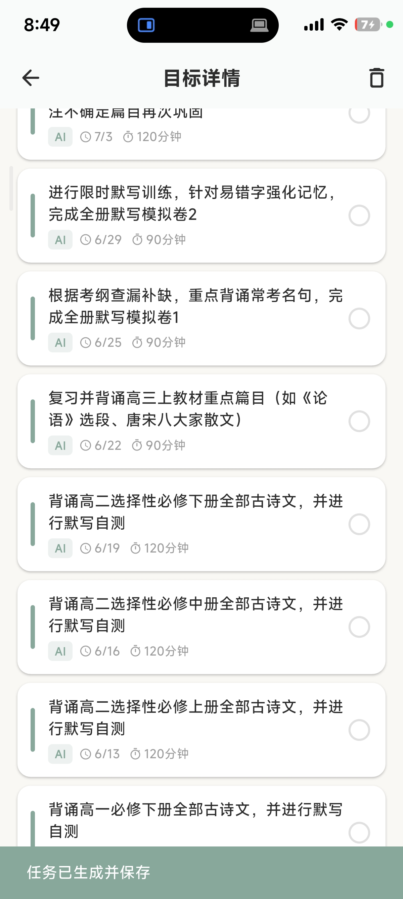
  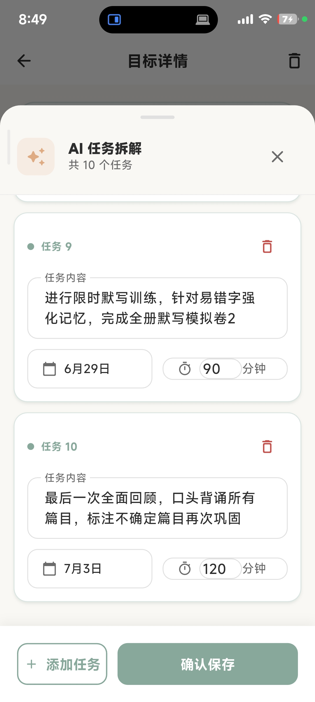
  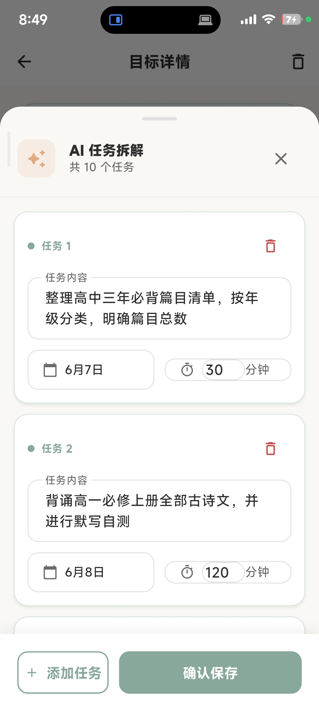
  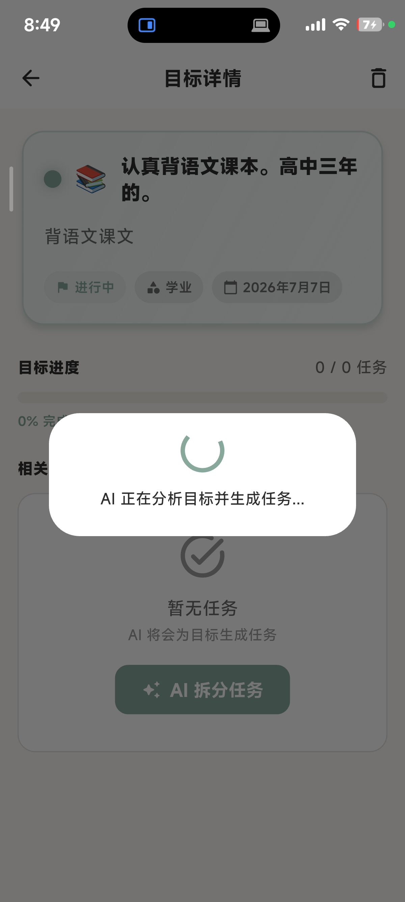
</p>

---

## 📱 应用简介

BenWo（本我）是一款帮助用户管理长期目标、每日任务、日历计划和个人画像的 Flutter 应用。通过 AI 智能目标拆解，将大目标转化为可执行的每日任务，配合日历视图、拖拽调度、完成庆祝等交互，让目标达成变得更简单、更有趣。

---

## ✨ 核心功能

### 🎯 目标管理
- **大目标创建**：设置目标标题、描述、分类（学业/职业/健康/关系/个人成长/财务）、目标颜色和截止日期
- **目标列表**：查看所有目标及其状态（进行中/已完成/已放弃）
- **目标详情**：查看目标下的所有任务和进度
- **目标删除**：支持删除目标并级联删除关联任务

### 🤖 AI 目标拆解
- **DeepSeek API 驱动**：调用 DeepSeek 大模型，智能拆解大目标为 3–10 个具体可执行任务
- **JSON 结构化输出**：AI 返回严格 JSON 格式，包含任务内容、执行日期偏移量、预估时长
- **智能回退**：网络异常或 API 不可用时，自动使用本地任务模板（按学业/健康/职业/财务分类），确保流程不中断
- **AI 任务确认**：生成的任务可逐个确认、编辑内容、调整日期和时长后再保存

### 📅 日历视图
- **日视图**：左右滑动切换日期，展示当日任务列表，支持点击日期选择器快速跳转
- **周视图**：7 天一览，展开/收起每日任务，清晰显示每日大目标任务和个人任务数量
- **月视图**：网格日历，点击日期查看该日任务列表，圆点指示任务类型
- **拖拽调度**：长按任意未完成任务，拖放到目标日期即可重新安排，支持跨日/周/月视图拖拽
- **已完成历史**：查看历史完成的任务记录
- **显示切换**：一键切换显示/隐藏已完成任务

### ✅ 今日待办（首页）
- **今日任务列表**：按 AI 生成任务优先排列，显示任务内容、预估时长、关联目标
- **AI 任务完成确认**：完成 AI 生成的任务前，需依次回答反思问题（如"你认真思考过这个问题了吗？"），防止盲目打勾
- **自建任务**：用户可创建独立待办，无关联目标
- **任务编辑**：点击任务进入详情，可修改内容、关联目标、预估时长，或删除任务
- **目标进度概览**：顶部显示进行中的目标摘要卡片

### 🎉 目标完成检测与庆祝
- **自动检测**：当目标下所有任务完成后，自动将目标标记为"已完成"
- **庆祝动画**：弹窗展示弹性缩放动画，包含目标标题、分类图标、完成时间
- **完成时间记录**：准确记录目标完成日期

### 👤 用户画像
- **MBTI 类型**：16 种 MBTI 人格类型选择
- **沟通偏好**：直接型/委婉型/书面型/口头型
- **激励敏感度**：高/中/低
- **最佳工作时间**：早晨/上午/下午/晚上/深夜
- **压力反应**：积极应对/消极应对/寻求帮助/独自承受
- **社交偏好**：独处/小圈子/大圈子/视情况

### 🚀 Onboarding 引导
- **第 1 步 · 我是谁**：输入姓名、年龄、职业、所在地区
- **第 2 步 · 我的现状**：选择当前面临的挑战（多选）和生活状态（学生/在职/自由职业/退休）
- **第 3 步 · 我想要什么**：输入最想改变的三个方面，选择期望的时间周期
- **第 4 步 · AI 分析确认**：AI 生成用户画像总结，建议初始大目标，可编辑后确认完成

### 🔔 推送通知
- **本地通知**：支持每日任务提醒
- **推送频率**：可设置每天一次、每天两次、仅早上、仅晚上
- **免打扰提示**：引导用户在系统设置中管理通知

### 🌍 国际化
- **中文/English** 双语支持

### 🔐 安全与隐私
- **本地存储**：所有用户数据（账号、目标、任务、画像、设置）默认存储在本地 Isar 数据库
- **API 密钥保护**：DeepSeek API 密钥通过 `--dart-define` 环境变量或本地配置文件管理，不上传到 GitHub
- **隐私政策**：应用内提供完整的用户协议和隐私政策说明

---

## 🛠️ 技术架构

### 架构模式：Clean Architecture + Riverpod

```
lib/
├── main.dart                          # 应用入口
├── app.dart                           # 根组件（MaterialApp.router）
├── application/                       # 应用层（Riverpod Notifiers）
│   ├── auth/                          # 认证状态管理
│   ├── goal/                          # 目标拆解 & 完成检测
│   ├── onboarding/                    # Onboarding 流程
│   └── profile/                       # 用户画像管理
├── core/                              # 核心基础设施
│   ├── constants/                     # API 常量 & 应用常量
│   ├── di/                            # 依赖注入（GetIt）
│   ├── error/                         # 异常 & 失败定义
│   ├── theme/                         # 主题 & 颜色系统
│   └── utils/                         # 工具类（认证、通知）
├── data/                              # 数据层
│   ├── datasources/local/             # Isar 本地数据库
│   ├── models/                        # 数据模型（Isar + JSON）
│   └── repositories/                  # 仓库实现
├── presentation/                      # 展示层
│   ├── pages/
│   │   ├── auth/                      # 登录 & 注册
│   │   ├── calendar/                  # 日历（日/周/月视图）
│   │   ├── goals/                     # 目标列表/创建/详情
│   │   ├── home/                      # 首页（今日待办）
│   │   ├── onboarding/                # 新用户引导
│   │   ├── profile/                   # 用户画像
│   │   └── settings/                  # 设置
│   └── shared/widgets/                # 共享 UI 组件
├── routes/                            # GoRouter 路由 & 认证守卫
└── shared/widgets/                    # 通用组件
```

### 技术栈

| 分类 | 技术 | 版本 |
|------|------|------|
| 框架 | Flutter | 3.x |
| 状态管理 | flutter_riverpod | ^2.6.1 |
| 导航 | go_router | ^14.8.1 |
| 本地数据库 | Isar | ^3.1.0+1 |
| 网络请求 | Dio | ^5.7.0 |
| 本地存储 | SharedPreferences | ^2.3.4 |
| 依赖注入 | GetIt | - |
| 本地通知 | flutter_local_notifications | ^18.0.1 |
| 国际化 | intl | - |
| AI 服务 | DeepSeek API | deepseek-v4-flash |

---

## 🚀 快速开始

### 环境要求

- Flutter SDK >= 3.11.4
- Android SDK（用于构建 APK）
- DeepSeek API Key（用于 AI 目标拆解功能）

### 安装步骤

```bash
# 1. 克隆仓库
git clone https://github.com/jcx396905-gif/benwo.git
cd benwo

# 2. 配置 API 密钥
# 复制示例配置并填入你的 DeepSeek API Key
cp lib/core/constants/api_constants.example.dart lib/core/constants/api_constants.dart
# 编辑 api_constants.dart，将 YOUR_DEEPSEEK_API_KEY 替换为实际密钥

# 或者通过命令行参数传入（推荐用于 CI/CD）
# flutter build apk --dart-define=DEEPSEEK_API_KEY=your_key

# 3. 安装依赖
flutter pub get

# 4. 生成 Isar 代码（如果修改了数据模型）
dart run build_runner build

# 5. 运行应用
flutter run
```

### 构建 APK

```bash
# Debug 版本
flutter build apk --debug

# Release 版本
flutter build apk --release
```

APK 文件位于 `build/app/outputs/flutter-apk/app-release.apk`

---

## 📸 应用截图

### 首页 & 目标管理
<p align="center">
  
  
  
  
</p>

### 日历视图（日/周/月）
<p align="center">
  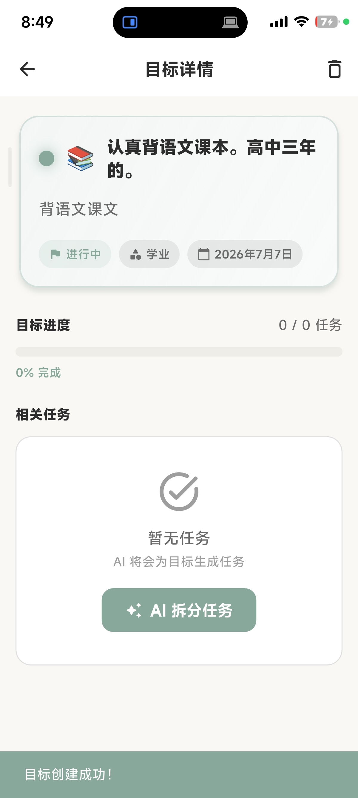
  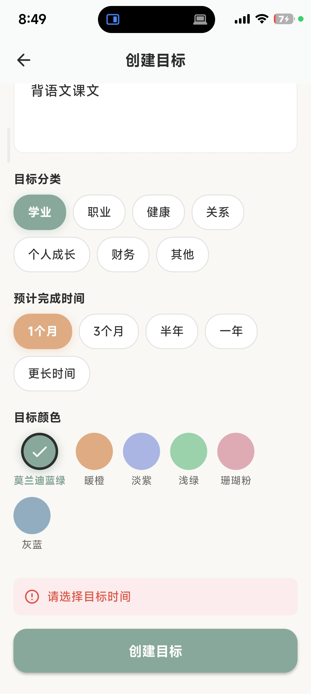
  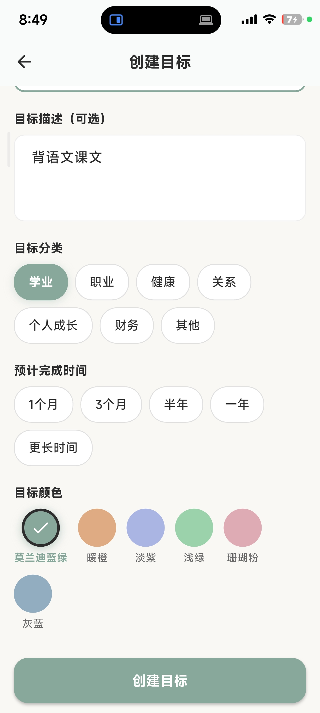
  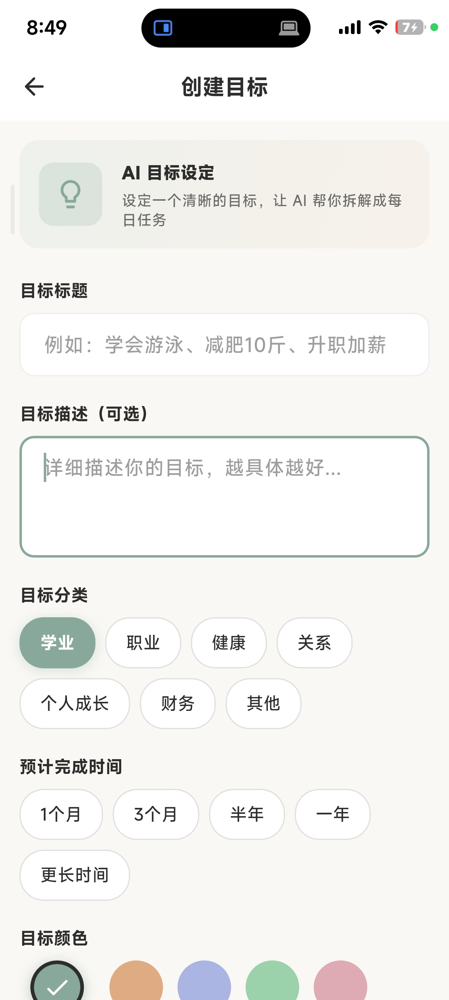
</p>

### AI 功能 & 更多
<p align="center">
  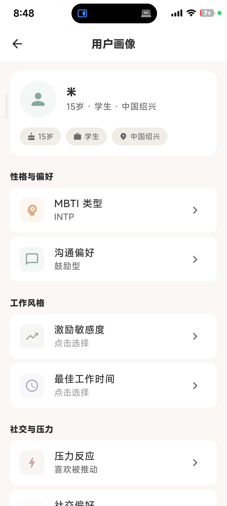
  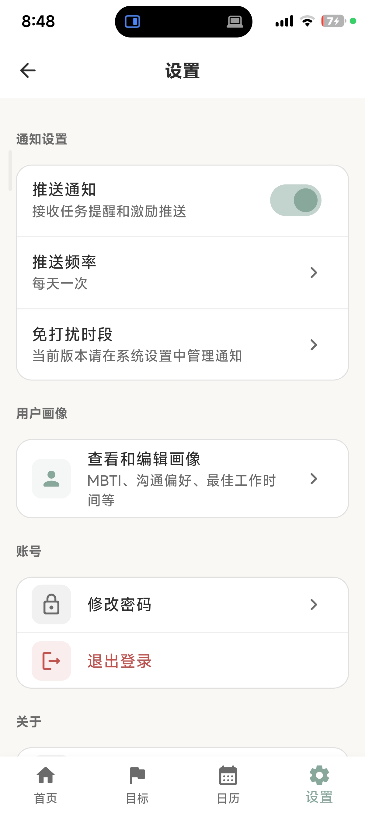
  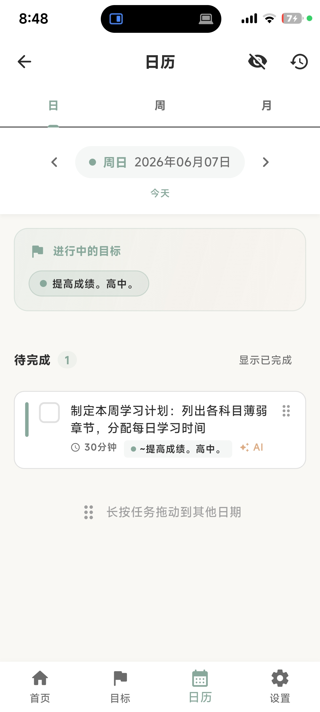
  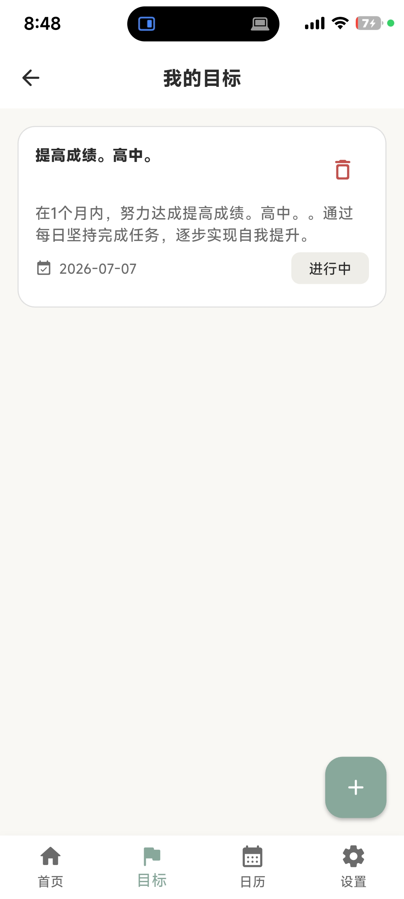
  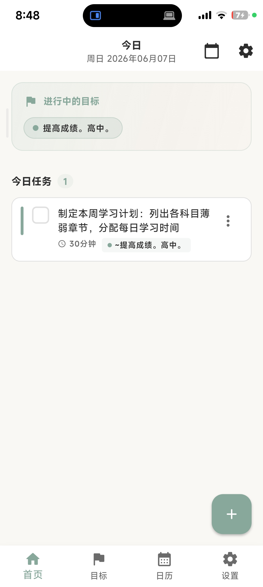
</p>

---

## 📝 API 配置说明

本应用使用 DeepSeek API 进行 AI 目标拆解。API 密钥支持两种配置方式：

1. **本地配置文件**（开发推荐）：
   ```bash
   cp lib/core/constants/api_constants.example.dart lib/core/constants/api_constants.dart
   # 编辑 api_constants.dart，填入你的 API Key
   ```

2. **命令行参数**（CI/CD 推荐）：
   ```bash
   flutter build apk --dart-define=DEEPSEEK_API_KEY=sk-your-key
   flutter run --dart-define=DEEPSEEK_API_KEY=sk-your-key
   ```

> ⚠️ **注意**：`api_constants.dart` 已加入 `.gitignore`，不会被提交到 Git 仓库。请勿将真实 API 密钥上传到公开仓库。

---

## 👨‍💻 作者

**JCX**

- GitHub: [@jcx396905-gif](https://github.com/jcx396905-gif)

---

## 📄 许可证

本项目仅供个人学习和使用。

---

## 🔄 版本历史

- **v1.0.0** - 首个完整版本
  - 用户认证（登录/注册）
  - Onboarding 引导流程
  - 大目标创建与管理
  - AI 目标拆解（DeepSeek API）
  - 今日待办列表
  - 日历视图（日/周/月）含拖拽功能
  - 目标完成检测与庆祝动画
  - 用户画像（MBTI 等 6 个维度）
  - 推送通知
  - 中英文双语支持
