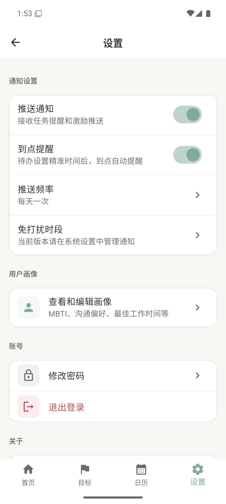
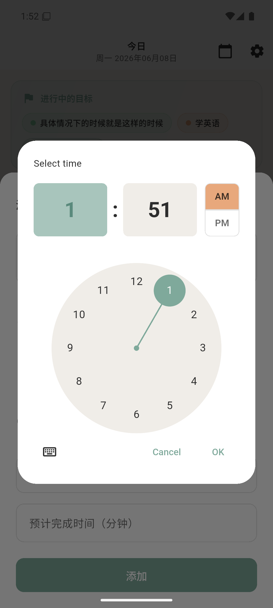
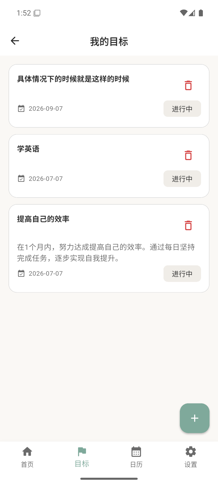
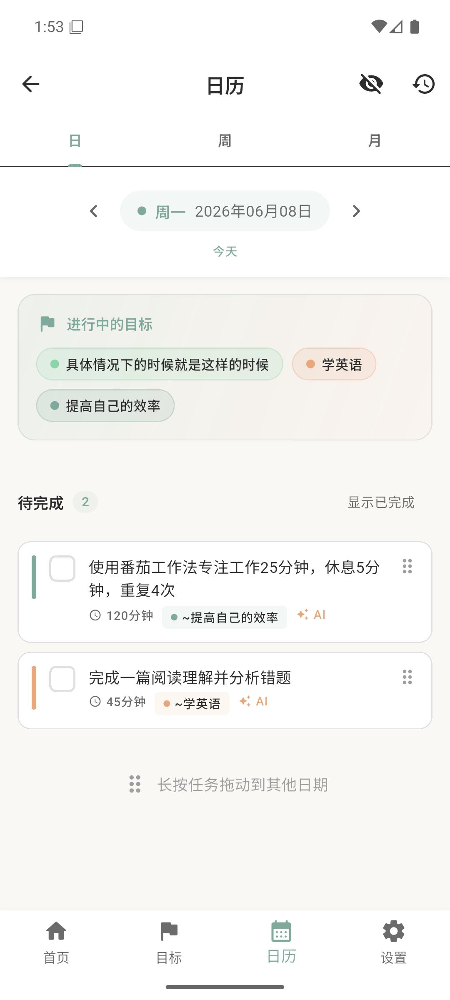
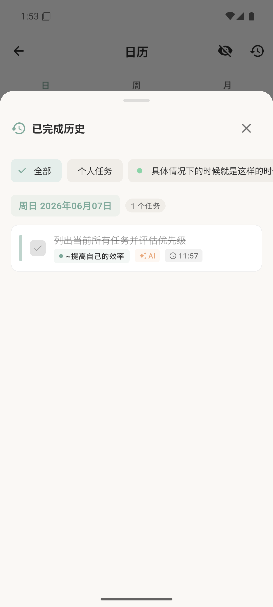

# BenWo（本我）

> AI 驱动的自我探索与目标达成应用。探索本我，达成目标。

<p align="center">
  
</p>

<p align="center">
  
  
  
  
</p>

---

## 应用简介

BenWo（本我）是一款帮助用户管理长期目标、每日待办、日历计划和个人画像的 Flutter 应用。它通过 DeepSeek AI 将大目标或一段自然语言待办拆成可执行任务，并结合精准完成时间、到点提醒、日历调度和用户画像，让计划更贴合个人状态。

---

## 新版更新（2026-06-08）

- 接入 DeepSeek OpenAI-compatible API，默认模型为 `deepseek-v4-flash`。
- 首页添加待办支持“精准完成时间”，可以选择几点几分完成。
- AI 拆分待办支持“AI 自动选择”数量，并能识别自然语言里的日期和时间。
- 大目标 AI 拆分后，生成任务可继续手动加入或清除精准时间。
- 新增“到点提醒”设置项，默认开启；带精准时间的待办会自动注册本地提醒。
- AI 任务拆分 prompt 已读取用户画像，用于个性化拆分、时间安排和表达方式。
- 修复首页、日历、已完成历史、目标入口等页面的加载与路由问题。
- 更新 Material Design 风格启动图标，并在设置页保留作者 JCX 和彩蛋。
- 清理静态分析问题、旧 MiniMax 命名残留和冗余代码，`flutter analyze` 当前无问题。

---

## 核心功能

### 目标管理

- 创建长期目标：支持标题、描述、分类、颜色、预期完成时间和自定义选项。
- 查看目标列表：展示进行中目标、截止日期和状态。
- 目标详情：查看相关任务、进度、AI 拆分入口。
- 删除目标：可删除目标并处理相关任务。

### AI 拆分

- 大目标拆分：把长期目标拆成多个阶段性待办。
- 首页待办拆分：输入一大段话，即可用 AI 自动拆成多个待办。
- 数量控制：支持 3/5/8/10 个，也支持 AI 自动选择。
- 时间理解：能识别“今天下午3点”“明天 09:30”“18点20分”等时间表达。
- 用户画像：AI prompt 会读取 MBTI、沟通偏好、最佳工作时间、压力反应等信息。
- 本地回退：API 不可用时使用本地模板，保证主流程可继续。

### 今日待办

- 显示今日任务、预估时长、关联目标。
- 手动新增待办，支持日期、精准时间、目标关联、预估分钟数。
- AI 新增待办，支持默认日期、默认精准时间和自动拆分。
- 完成待办后会同步取消提醒；重新变为未完成时会重新安排提醒。

### 日历

- 日 / 周 / 月三种视图。
- 支持切换日期、查看每日任务、移动任务日期。
- 移动任务日期时会保留原来的精准时间。
- 已完成历史页可查看完成记录和时间。

### 设置与通知

- 推送通知开关。
- 到点提醒开关，默认开启。
- 推送频率与免打扰提示。
- 用户画像入口。
- 关于、作者 JCX、隐私说明和 AI 服务信息。

---

## 应用截图

### 首页与待办

<p align="center">
  
  
  
</p>

### AI 与目标

<p align="center">
  
  
  
</p>

### 日历与设置

<p align="center">
  
  
  
</p>

---

## 技术架构

```text
lib/
├── main.dart
├── app.dart
├── application/
│   ├── auth/
│   ├── goal/
│   ├── onboarding/
│   └── profile/
├── core/
│   ├── constants/
│   ├── di/
│   ├── error/
│   ├── theme/
│   └── utils/
├── data/
│   ├── datasources/local/
│   ├── models/
│   └── repositories/
├── presentation/
│   └── pages/
└── routes/
```

| 分类 | 技术 |
| --- | --- |
| 框架 | Flutter |
| 状态管理 | Riverpod |
| 路由 | GoRouter |
| 本地数据库 | Isar |
| 网络请求 | Dio |
| 本地设置 | SharedPreferences |
| 通知 | flutter_local_notifications |
| AI 服务 | DeepSeek API |

---

## 快速开始

### 环境要求

- Flutter SDK
- Android SDK / Android Studio
- DeepSeek API Key（AI 功能需要）

### 安装依赖

```bash
flutter pub get
```

### 配置 API Key

推荐使用命令行参数，不要把真实 key 写进 Git：

```bash
flutter run --dart-define=DEEPSEEK_API_KEY=your_key
flutter build apk --debug --dart-define=DEEPSEEK_API_KEY=your_key
```

也可以复制示例配置：

```bash
cp lib/core/constants/api_constants.example.dart lib/core/constants/api_constants.dart
```

`lib/core/constants/api_constants.dart` 已加入 `.gitignore`，不会提交到 GitHub。

### 运行

```bash
flutter run
```

### 构建 APK

```bash
flutter build apk --debug
flutter build apk --release
```

APK 输出目录：

```text
build/app/outputs/flutter-apk/
```

---

## 自测记录

本版本已完成以下检查：

- `flutter analyze --no-fatal-infos`：无问题。
- `flutter test`：通过。
- `flutter build apk --debug`：通过。
- `flutter build apk --release`：通过，生成版本 `1.0.1+2`。
- Android 模拟器验证：首页、目标、日历、设置、添加待办、AI 拆分选项、精准时间选择、到点提醒开关、已完成历史、目标详情均可打开和交互。
- Crash log：未发现崩溃记录。

---

## 作者

**JCX**

- GitHub: [@jcx396905-gif](https://github.com/jcx396905-gif)

---

## 版本历史

- **v1.0.1** - 精准时间、到点提醒、AI 待办拆分与用户画像增强
- **v1.0.0** - 登录注册、Onboarding、目标管理、AI 目标拆分、今日待办、日历视图、用户画像、通知设置
